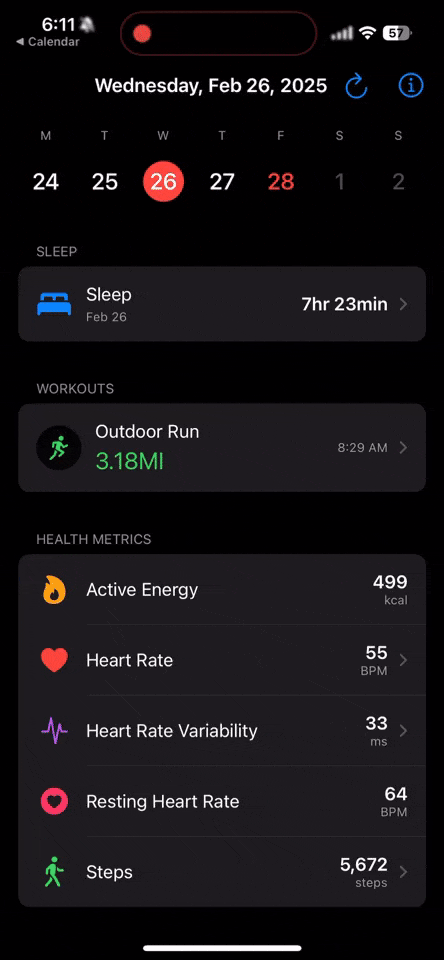

# Basal

A basic SwiftUI app that requests and displays HealthKit data almost identically to Apple's Health and Fitness apps. Use it as a starting point for building your own HealthKit apps.

## Testing in Simulator

It's best to test on an actual device to see data. If you test in simulator, make sure to complete the Health app onboarding first.

- Build the app from Xcode
- Open the **Health app** (`⌘ + ⇧ + H` to open the home screen)
- Complete the Health app onboarding
- Open the **Basal app**

## Demo

